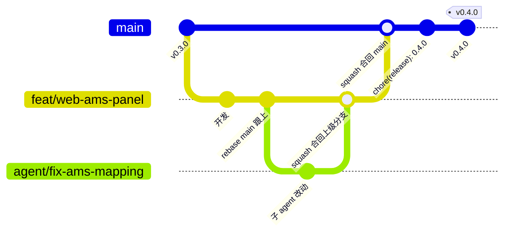

# 分支与发布规范

这份文档写给日常维护 bpq 的人（包括作为规划者/编码者协作的 Claude Code 会话），
目的是维护时能直接照抄命令，不用每次重新想「这个场景该怎么操作 git」。

红线类约束（什么不能做）已经写在 [CONTRIBUTING.md](../CONTRIBUTING.md) 和项目根
[CLAUDE.md](../CLAUDE.md) 里，本文档不重复，只讲**怎么操作分支和发布**这一件事。

## 一、一张图看懂分支布局



图里的合并线画成了 merge，是为了看清分支从哪来、回哪去；实际操作用的是
`git merge --squash`，**不产生 merge commit**，合回去只有一条重写过的提交。

`main` 是唯一的长期主干，其余分支都是从它切出去、干完活再合回来的短命分支：

- **`feat/*` `fix/*`**：从 `main` 切出，改完用 `git merge --squash` 合回 `main`，删掉。
- **`agent/*`**：调度者派子 agent 做一张任务卡时，用 `git worktree` 从某个分支
  （通常是 `main`，有时是正在进行的 `feat/*`）拉出来，干完同样 `squash` 合回
  拉出它的那个「上级分支」，删掉。
- **`vX.Y.Z` 标签**：打在 `main` 上，推到远端后触发 `.github/workflows/release.yml`，
  云端自动构建 Linux / Windows / macOS 三个单文件可执行程序，推一份 Docker 镜像到
  `ghcr.io`，一起挂到对应的 GitHub Release。

### `release/0.N.x`：只在给旧版本打补丁时才出现

这条分支不是常态，只有下面这种情况才需要建：

| main 的状态 | 处理方式 |
|---|---|
| main 还没往前走，或往前走的改动跟这个 bug 无关 | 不建 `release/*`，直接在 `main` 上开 `fix/*` 修，正常发下一个版本 |
| main 已经有不兼容改动（比如换了 config 字段），但旧 MINOR 版本还有人在用，需要单独出一个 PATCH | 建 `release/0.N.x`，从旧版本的 tag 切出，见「案例 7」 |

`release/0.N.x` 和 `feat/*`／`agent/*` 的本质区别是**不合回 main**——它是给旧版本
续命的分支，自己身上打 PATCH tag，不参与主干的演进。

## 二、分支速查表

| 分支 | 什么时候建 | 生命周期 | 怎么合 | 合完 |
|---|---|---|---|---|
| `main` | 仓库建立时就有，只有一次 | 永久 | 不合入别的分支，是所有分支的合并终点 | 不适用；每次发布在它上面打 tag |
| `feat\|fix\|docs\|chore\|refactor\|test/*` | 开始一项独立改动前，从 `main` 切出。命名 `<type>/<scope>-<短描述>`，scope 用项目模块名：`scheduler` `web` `transport` `daemon` `store`，例如 `feat/web-ams-panel` | 几小时到几天，合入 main 即结束 | `git merge --squash` 合入 `main`，重写成一条 Conventional Commits 中文提交 | `git branch -d` 删除本地分支（远端有推送的话一并删） |
| `agent/*` | 调度者派子 agent 做一张任务卡时，配合 `git worktree add` 建。命名 `agent/<任务卡短名>`，**禁止使用工具默认生成的 `worktree-agent-<hash>`** | 一张任务卡的寿命：子 agent 干完、调度者验证并合并后即结束 | 调度者读 diff 确认无误后 `git merge --squash` 合回上级分支，重写成一条中文 Conventional Commits 提交 | `git worktree remove` 移除工作区 + `git branch -D` 删分支（squash 后 Git 认不出已合并，必须用 `-D`） |
| `release/0.N.x` | 需要给已发布的旧 MINOR 版本打补丁、而 main 已经往前走时建，从旧版本的 tag 切出 | 长期存在，该旧版本还有人用就留着 | **不合回 main**；只在自己身上打 PATCH tag；必要时把修复单独 `cherry-pick` 到 main | 不删，留着等下一次同一旧版本需要打补丁 |
| `archive/*`（tag，不是分支） | 一条分支不再需要、但不想让它彻底不可达时，删分支前先打这个 tag | 永久（tag 不会被日常清理误删） | 不合，是「删除分支前的归档动作」：`git tag -a archive/<名字>-<日期>` | 打完 tag 就删原分支；历史仍可通过 tag 找回 |

## 三、日常维护操作案例

### 1. 加个新功能

场景：要做一个不算紧急的功能，比如给 WebUI 加个新的状态面板。

```bash
git switch main
```

```bash
git pull
```

```bash
git switch -c feat/web-ams-panel
```

开发过程中如果 `main` 有了新提交（比如别人先合了一个 fix），用 rebase 跟上，
保持这条分支的历史是线性的：

```bash
git fetch origin
```

```bash
git rebase origin/main
```

遇到冲突就按提示手动改文件，`git add` 对应文件后继续：

```bash
git rebase --continue
```

开发完成，合回 `main`：

```bash
git switch main
```

```bash
git merge --squash feat/web-ams-panel
```

```bash
git commit
```

`merge --squash` 只是把改动摆进暂存区，不会自动提交，这一步的提交信息要自己写成
一条 Conventional Commits 格式的中文提交（比如 `feat(web): 加 AMS 槽位可视化面板`），
不要把开发过程中的碎提交原样带进 main。

```bash
git branch -d feat/web-ams-panel
```

```bash
git push origin main
```

### 2. 修一个线上 bug（当前版本）

场景：`main` 当前这个版本（还没打下一个 tag）发现 bug，比如日志重复写入。

```bash
git switch main
```

```bash
git pull
```

```bash
git switch -c fix/scheduler-duplicate-log
```

改完、本地跑过 `pytest` 确认没引入新问题之后：

```bash
git switch main
```

```bash
git merge --squash fix/scheduler-duplicate-log
```

```bash
git commit
```

```bash
git branch -d fix/scheduler-duplicate-log
```

```bash
git push origin main
```

要不要立刻发版：如果这个 bug 碰到「触发前必须完全静默」「打印机被误触发」这类红线
相关行为，或者影响已发布可执行文件的正常使用（崩溃、任务丢失），合入 `main` 后
立刻按「案例 4」发一个 PATCH 版本。如果只是内部小问题（日志格式、注释），可以先
攒着，跟下一批改动一起发，不必为了一行 fix 单独跑一次发布流程。

### 3. 派子 agent 做一张任务卡

场景：调度者把一张任务卡（比如「给 WebUI 加个 AMS 槽位可视化」）派给子 agent 去
实现，需要一个独立的工作目录，不干扰当前正在用的工作区。

```bash
git switch main
```

```bash
git pull
```

```bash
git worktree add ../bpq-agent-ams-panel -b agent/ams-panel main
```

分支名必须是有意义的 `agent/<任务卡短名>`，不能用工具默认生成的
`worktree-agent-<hash>` 这种名字——仓库的开发历史（`archive/dev-20260825`）里能
翻到几条 `Merge branch 'worktree-agent-a253bf92d1d8aafe4'` 这样的合并记录，光看
分支名完全看不出当年这个任务卡做的是什么，事后排查无从下手。

子 agent 在 `../bpq-agent-ams-panel` 里完成改动之后，调度者**在自己的工作区**里
读 diff 验证，不要只看子 agent 的自我总结：

```bash
git -C ../bpq-agent-ams-panel diff main
```

或者只看提交列表：

```bash
git -C ../bpq-agent-ams-panel log --oneline main..HEAD
```

确认改动符合任务卡要求、没有碰红线，回到主工作区合并：

```bash
git switch main
```

```bash
git merge --squash agent/ams-panel
```

```bash
git commit
```

这一步的提交信息由调度者重写成**一条**中文 Conventional Commits 提交，概括这张
任务卡做了什么、为什么这么做，不要把子 agent 自己写的多条零散提交原样带进 main。

收尾清理：

```bash
git worktree remove ../bpq-agent-ams-panel
```

```bash
git branch -D agent/ams-panel
```

清理用 `-D` 而不是 `-d`：`merge --squash` 产生的是一条全新提交，Git 看不出
`agent/ams-panel` 和 `main` 之间的父子关系，`-d` 会因为「分支未合并」被拒绝。

### 4. 发一个新版本

场景：`main` 上攒了几个 `feat`/`fix`，决定发 `v0.4.0`。

第一步，把 [CHANGELOG.md](../CHANGELOG.md) 里这个版本的改动整理好（沿用现有的
Keep a Changelog 格式：新增 / 修复 / 变更）。

第二步，同步版本号，项目里目前有两处真源，都要改：`pyproject.toml` 的
`version = "0.4.0"`，以及 `src/bpq/__init__.py` 的 `__version__ = "0.4.0"`（这两处
不同步的风险和改进建议见本文档「四、版本号怎么定」一节）。

第三步，提交：

```bash
git add CHANGELOG.md pyproject.toml src/bpq/__init__.py
```

```bash
git commit -m "chore(release): 发布 0.4.0"
```

第四步，推 `main`：

```bash
git push origin main
```

第五步，**等 CI 绿**——去 GitHub 上确认 `ci.yml`（lint + mypy + pytest + 前端构建）
跑通再往下走。这一步不能跳：`release.yml` 只管打包不管质量检查，`main` 上代码
是否可靠完全靠 `ci.yml` 把关。

第六步，CI 绿了之后打 tag 并推：

```bash
git tag -a v0.4.0 -m "v0.4.0"
```

```bash
git push origin v0.4.0
```

推完 tag，`release.yml` 自动触发：三平台 PyInstaller 打包、Docker 镜像推到
`ghcr.io/owenwoow/bambu-print-queue`，一起挂到 GitHub 上新建的 `v0.4.0` Release。

**必须先推 main 再打 tag**，顺序不能反：`release.yml` 的 `build-binaries` job 里
`actions/checkout@v4` 没有指定 `ref`，默认签出触发这次运行的那个引用——也就是 tag
自己指向的那个 commit。如果 tag 打在一个还没推到远端的本地 `main` 上，或者 tag
落后于本地 `main`，云端打包出来的东西就不是你以为的那份代码，而是远端当时能看到
的最后一个状态。

### 5. 发一个预发布 rc

场景：`v0.4.0` 还没完全准备好，想先出一个 `v0.4.0-rc.1` 给自己或小范围用户验证。

```bash
git tag -a v0.4.0-rc.1 -m "v0.4.0-rc.1"
```

```bash
git push origin v0.4.0-rc.1
```

**⚠️ 现状下这样做有副作用，先读完再决定要不要推。** `.github/workflows/release.yml`
的 tag 触发条件是 `v*.*.*`，`v0.4.0-rc.1` 能匹配上，会正常触发三平台打包和
docker 构建；但 docker 那一步的 tag 策略目前是：

```yaml
tags: |
  type=semver,pattern={{version}}
  type=raw,value=latest
```

`type=raw,value=latest` 没有任何条件限制，不管这次推的是不是正式版都会覆盖
`ghcr.io/owenwoow/bambu-print-queue:latest`。也就是说，**推一个 rc tag 会把用户
`docker compose pull` 拉到的 `latest` 镜像换成这个 rc 版本**——这是当前
`release.yml` 的一个已知缺陷，不是设计如此，在修复落地之前不要在没有心理准备的
情况下推 rc tag。

对应的修法（下次改 `release.yml` 时用）：docker 镜像的 `latest` 只在正式版才打，
用 `github.ref_name` 里有没有 `-` 判断是不是预发布：

```yaml
tags: |
  type=semver,pattern={{version}}
  type=raw,value=latest,enable=${{ !contains(github.ref_name, '-') }}
```

`release` job 里 `softprops/action-gh-release@v2` 加一行，让 rc 标签在 GitHub
Release 页面上正确标成「预发行版」：

```yaml
prerelease: ${{ contains(github.ref_name, '-') }}
```

### 6. 收一个外部 PR

场景：有人提了 PR，需要本地验证再决定合不合。

```bash
gh pr checkout 123 -b review/pr-123
```

`-b` 指定一个明确的本地分支名，不依赖 `gh` 默认取的远端分支名，方便后面确定要
删的是哪条分支。

跑测试：

```bash
pip install -e ".[dev]"
```

```bash
ruff check .
```

```bash
mypy
```

```bash
pytest
```

PR 改了前端就再验证一下构建能过：

```bash
npm --prefix web install
```

```bash
npm --prefix web run build
```

测试通过后，对照 [CONTRIBUTING.md](../CONTRIBUTING.md) 的红线过一遍，尤其最容易
踩、后果也最直接的两条：

- **触发前必须完全静默**——PR 有没有让打印机在到点之前产生任何动作（预热、转
  风扇、发探测状态的指令）？
- **不得在 daemon 运行期间另建 MQTT 连接**——打印机数据是不是老老实实走了
  `PrinterLink`；如果 PR 加了个从别的进程直接连打印机的路径，一律打回去。

确认没问题，回到 GitHub 网页上用 **Squash and merge**（不用命令行合并，网页操作
能留住 PR 的 review 记录和讨论链接），合并时把标题重写成 Conventional Commits
格式。

清理本地分支：

```bash
git branch -D review/pr-123
```

### 7. 给旧版打补丁

场景：`main` 已经往前走到 `v0.4.0`（里面有不兼容改动），但还在用 `v0.3.0` 的用户
反馈了一个不算严重、不想强推他们升级到 0.4 的 bug。

从旧版本的 tag 切出补丁分支：

```bash
git switch -c release/0.3.x v0.3.0
```

```bash
git push -u origin release/0.3.x
```

改完之后正常提交（先看一下改了哪些文件，避免用 `add -A` 带进不相关的改动）：

```bash
git status
```

```bash
git add src/bpq/scheduler.py
```

```bash
git commit -m "fix(scheduler): 修 xxx"
```

打 PATCH tag 并推：

```bash
git tag -a v0.3.1 -m "v0.3.1"
```

```bash
git push origin v0.3.1
```

`release.yml` 的 tag 触发条件不关心这个 tag 是从哪条分支打出来的，只要是
`v*.*.*` 就会构建，所以这一步同样会自动出三平台二进制和 Docker 镜像。

要不要把这个修复 `cherry-pick` 回 `main`：如果 `main` 上这段代码逻辑还在、这个
bug 依然存在，就 cherry-pick 一份过去：

```bash
git switch main
```

```bash
git cherry-pick <commit-sha>
```

如果 `main` 已经把这块代码重写得面目全非（换了实现方式、数据结构不一样了），
`cherry-pick` 大概率冲突到没有意义，直接在 `main` 上另开一个 `fix/*`、按新写法
重新修一遍，不用勉强移植旧分支的 diff。

### 8. 一条分支不要了 / 停更了

场景：某个 `feat/*` 做到一半发现方向不对，决定放弃，但不想让这段历史彻底消失。

不要直接 `git branch -D`。先打一个归档 tag：

```bash
git tag -a archive/feat-xxx-20260828 -m "归档：方案在评审阶段被否，原因见 PR #45 讨论"
```

```bash
git push origin archive/feat-xxx-20260828
```

再删分支：

```bash
git branch -D feat/xxx
```

这样这段历史永久可达，tag 不会像分支一样在日常清理时被误删。以后想恢复，直接
从归档 tag 拉回一条同名分支就行：

```bash
git branch feat/xxx archive/feat-xxx-20260828
```

### 9. 定期体检

下面这些都是只读命令，不改动任何东西，适合每隔一段时间跑一遍，看看仓库有没有
堆积的垃圾分支或忘了清的 worktree。

看本地分支分别领先/落后远端多少：

```bash
git branch -vv
```

哪些分支已经用普通 merge 合并进 `main`，可以删了：

```bash
git branch --merged main
```

反过来，哪些还没合并（**注意**：`agent/*` 和 `feat/*` 用的是 `merge --squash`，
即使已经合并、仍然会出现在 `--no-merged` 里，因为 squash 不留父子关系记录——这正
是「案例 3」「案例 1」里必须手动确认后用 `-D` 强删的原因，体检看到这里不能直接
当真）：

```bash
git branch --no-merged main
```

同步远端分支的删除情况，清掉本地过期的 remote-tracking 引用：

```bash
git fetch --prune
```

有没有忘了 `git worktree remove` 的工作区：

```bash
git worktree list
```

工作区本身有没有未提交的改动：

```bash
git status
```

## 四、版本号怎么定

项目还在 0.x 阶段，`MAJOR` 不用管，判据集中在 `MINOR` 和 `PATCH` 怎么选：

| 改动类型 | 版本位 | 判据 |
|---|---|---|
| `config.toml` 字段不兼容旧配置 | 升 MINOR | 旧配置文件加载会出错或语义变了 |
| SQLite `SCHEMA_VERSION` 需要不可逆迁移 | 升 MINOR | 数据库结构变了，回不去 |
| HTTP API 路径或字段变更 | 升 MINOR | WebUI 依赖的接口契约变了 |
| WebUI 视觉调整 | 升 PATCH | 界面变了但接口、数据、配置都没变 |
| 内部重构 | 升 PATCH | 外部行为不变，只是代码内部结构调整 |
| bug 修复 | 升 PATCH | 修正错误行为，不引入新的不兼容 |

简单说：MINOR 对应「升级后旧的东西用不了了」，PATCH 对应「从外面看，接口、配置、
数据格式都没变」。

**改进建议**：现在版本号有两处真源——`pyproject.toml` 的 `version` 字段和
`src/bpq/__init__.py` 的 `__version__`——手改容易漏一处（「案例 4」第二步就是在
提醒这件事）。可以考虑：

- `pyproject.toml` 改成 `dynamic = ["version"]`，配合 hatchling 的
  `[tool.hatch.version]` 指向 `src/bpq/__init__.py`，把两处真源收成一处，只改
  `__version__` 就够了。
- 在 `release.yml` 里加一道校验：tag 去掉 `v` 前缀之后，要跟
  `python -c "import bpq; print(bpq.__version__)"` 的输出一致，不一致就让流水线
  失败，防止「忘改 `__init__.py` 就打了 tag」这种事发生。

## 五、本仓库的历史特殊情况

看 `git log` 或 `git branch -a` 时，下面这几点不了解的话会看不懂当前的分支布局，
这里先说清楚：

- **`main` 是为公开发布重做的孤儿干净历史**，只有 6 个提交，不包含 v0.1 到 v0.3
  的真实开发过程。这是有意为之——公开仓库不需要暴露调试试错的完整轨迹。
- **真实开发史归档在两个 tag 里**：`archive/dev-20260825`（50 个提交，v0.3
  WebUI 开发线，能看到前面提到的 `worktree-agent-<hash>` 这类分支当年是怎么合
  进来的）、`archive/master-20260825`（14 个提交，v0.1 到 v0.3 的原始主线）。
  想考古某个功能当年是怎么做出来的，用：
  ```bash
  git log archive/master-20260825 --oneline
  ```
- **`backup/main-before-rewrite`（a2f64d0）是 `main` 被 rebase（改写成孤儿历史）
  之前的旧历史备份**。远端的 `main` 和 `v0.3.0` tag 现在都已指向重写后的
  e74851b，本地与远端一致，**不需要再强推**。这条备份分支是旧 SHA 那条线在本地
  的唯一副本，确认不需要回退之前先留着；真要清理，按「案例 8」归档成
  `archive/*` tag 再删，别直接 `git branch -D`。
- 涉及重写已推送历史的操作（rebase 已推送的提交、`push --force`、移动已发布的
  tag）**必须由用户本人决定，agent 不得自行执行**，哪怕看起来「本地更对」。
